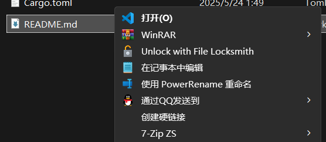

## 为 Windows 文件右键菜单添加“创建硬链接”

### 构建

```
cargo build --release
```

假设将构建产物存放于 `C:\Packages\windows-hard-link-context-menu.exe`.

### 创建注册表

在 `regedit` 中创建以下目录:

```
计算机\HKEY_CLASSES_ROOT\*\shell\创建硬链接\command\
```

将 `command` 目录的 `(默认)` 字段的值修改为 `C:\Packages\windows-hard-link-context-menu.exe %1`.

### 结果展示



点击“创建硬链接”，将在当前目录下创建文件名形如 `{STEM}.hl[.{EXT}]` 的硬链接文件。